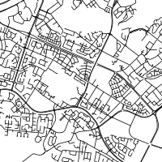
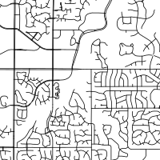
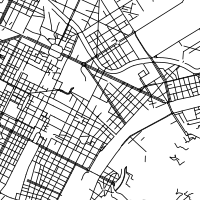

```{r setup, include=FALSE}
knitr::opts_chunk$set(echo = TRUE)
knitr::opts_chunk$set(fig.width=15)
knitr::opts_chunk$set(fig.height = 8)
knitr::opts_chunk$set(warning = FALSE)
knitr::opts_chunk$set(message = FALSE)
```

## Road Pattern dataset description

The reference data-set used in this workshop come from [https://geo.nyu.edu/catalog/stanford-yk247bg4748](stanford geo laboratory); This source contains polygons of urban areas all over the world with population estimate derived from Landsat images. Urbans ares from North and Central America and from Europe and Russia with a population of more than 200 000 peoples were extracted from this data source. Lets start by loading some required libraries, the data and draw a little map. You may start anew r-markdown document or r-script to store your work and follow these first steps. 

```{r cities,cache=TRUE,message=FALSE}
# load some libraries
library(sf)
library(dplyr)
library(tidyr)
library(ggplot2)
library(gridExtra)
library(cartography)
# set the seed
set.seed(42)
# load the datasets
cities = read_sf("./shp/Cities.shp") %>% filter(ang180!=0) %>% mutate(Cont=factor(Cont))
cont=read_sf("./shp/continent.shp")
# crop the background and plot
fond = st_crop(st_transform(st_geometry(cont),3395),st_bbox(st_transform(cities,3395)))
plot(fond, col = "grey60",border = "grey20")
propSymbolsTypoLayer(st_centroid(st_transform(cities,3395)),var="Pop",var2="Cont",
                     col=c("#e41a1c","#377eb8"),legend.var.title.txt="Population",
                     legend.var2.title.txt="Continent              ",
                     legend.var2.pos = "bottomleft",legend.var.pos = "n",legend.var2.frame=TRUE)
legendCirclesSymbols(pos = "topleft", 
                     var = c(200000,500000,1000000,5000000,10000000),
                     inches = 0.2, style = "e",col="gray",title.txt="Population",frame=TRUE)
```

These data were combined with the street networks extracted from open street map. This was perfomed using the [https://overpass-api.de/](overpass api) and the **osmdata** package for searching geographic entities with the **highway** tag with value equal to **primary,secondary,tertiary** or **residential**. This is for example the street network extracted for Pensacola and Seville :

```{r,cache=TRUE}
par(mfrow=c(1,2))
roads_app = read_sf("UranAreas/Pensacola.geojson")
plot(st_geometry(roads_app))
roads_app = read_sf("UranAreas/Seville.geojson")
plot(st_geometry(roads_app))
```


The final dataset contains informations on 587 urban areas with the folowing features :

```{r,cache=TRUE}
str(cities[,1:6])
```

were ang180,ang185,... correspond to the histogram counts of street angle for each urban area. The goal of this workshop is to study the link between street network shape or urban fabric and continent of origin. Population density already exhibit difference between Europe and North-America as shown by the following histogram with a lot more of dense urban areas in Europe.

```{r,cache=TRUE,fig.width=7,fig.height=4}
df_cities = cities %>% mutate(Area=as.numeric(st_area(geometry))) %>% mutate(Density=Pop/Area*10000)
ggplot(df_cities)+geom_histogram(aes(x=Density,fill=Cont),bins=25)+
  scale_fill_brewer(palette="Set1")+theme_bw()
```

If we look at the street angles (recreating the quite viral visuals of [https://geoffboeing.com/2018/07/comparing-city-street-orientations/](geoff boeing) or [https://mourner.github.io/road-orientation-map/#13.13/43.77238/11.24408](mourner)) the difference between Europe and North-America is also quite visible as shown with these samples.

```{r,cache=TRUE}
AnglesCounts = as.data.frame(cities)[,4:75]
df_Pa=AnglesCounts/rowSums(AnglesCounts)
levs=colnames(df_Pa)
df_Pa$City=cities$City
df_angles=gather(df_Pa,"deg","prob",-City) %>% mutate(deg=factor(deg,levels=levs)) 

exNA= cities%>% filter(Cont=="North America")  %>% sample_n(9)
ggNA=ggplot()+geom_bar(data=df_angles %>% right_join(exNA),aes(x=deg,y=prob,color=Cont,fill=Cont),stat="identity")+
  scale_y_continuous("",breaks=c())+scale_x_discrete("",breaks=c())+
  coord_polar()+facet_wrap(~City)+theme_bw()+
  scale_fill_brewer(palette="Set1",drop=FALSE,guide="none")+
  scale_color_brewer(palette="Set1",drop=FALSE,guide="none")

exEu= cities%>% filter(Cont=="Europe")  %>% sample_n(9)
ggEu=ggplot()+geom_bar(data=df_angles %>% right_join(exEu),aes(x=deg,y=prob,color=Cont,fill=Cont),stat="identity")+
  scale_y_continuous("",breaks=c())+scale_x_discrete("",breaks=c())+
  coord_polar()+facet_wrap(~City)+theme_bw()+
  scale_fill_brewer(palette="Set1",drop=FALSE,guide="none")+
  scale_color_brewer(palette="Set1",drop=FALSE,guide="none")

grid.arrange(ggEu,ggNA, nrow=1, ncol=2,top="")

```
A lot of urban areas from North-America exhibit a grid pattern which are clearly visbibles in the street orientation histograms.

In this workshop we will first build classifiers to recognize the region of an urban areas using two variables:

- the population density; 
- a feature extracted from the histograms;

This will enbale the visualisation of classifier results for pedagogical goals. In a second step we will tune classifiers to recognize the region of origin using all the available features as input. Eventually, we will introduce ourself to the keras package for deep-learning by trying to classify image patches of 200x200 pixels  (which correspond to 3km square patch) using convolutional neural networks, some example of training patch follow :


|   |   |   | 

The two main library that will be used in this workshop except the classical **dplyr,tidyr,ggplot,...** are **keras** for neural network and **caret**. Caret offers a unified interface to a lot of machine learning algorithms and will ease some important tasks such as hyper parameter tunning, model evaluation,...

```{r,cache=TRUE}
library(caret)
library(keras)
```

## Supervised classification on the plane

A classical first step in bulding a classifier is to split the dataset into a training and a testing set and performing some preprocessing such as feature standardization (subtract the mean, and divide by the standard deviation each feature). In this first code block we compute the entropie of the road orientation histogram, this will give us a measure of the predictability of these angles (intuitively this measure will be low for grids and high for historical centers with a lot more of variations in the angles).
We then build a data frame Xp with three varibales :

```{r,cache=TRUE}
entropie = -rowSums(df_Pa %>% select(-City)*log2(df_Pa %>% select(-City)))
Xp = as.data.frame(df_cities) %>% select(Cont,Density) 
Xp$entropie=entropie
summary(Xp)
```
The continent of the urban area (North America,Europe) which is the target feature and the two predictors. Then we may use the **createDataPartition** and **preProcess** functions from **caret** to split and normalize this dataset (normalization is important here for several methods since raw features have quite different ranges). Note that the mean and standard deviation used for scaling are computed on the train dataset only.

```{r,cache=TRUE}
intrain  = createDataPartition(Xp$Cont, list=FALSE,p = 0.75)
scaler = preProcess(Xp[intrain,-1])
Xp.train = predict(scaler,Xp[intrain,-1])
Xp.train$Cont=Xp$Cont[intrain]
Xp.test  = predict(scaler,Xp[-intrain,-1])
Xp.test$Cont=Xp$Cont[-intrain]
```

We may get a first picture of this simple dataset using a scatter plot (since we restrict ourself to two predictors in this first part). Urban areas from North-America exhibit a lower density and an higher entropie. These variables may then be helpfull to distinguish these two classes. We will start by running two classical classifier namely **logistic regression** and **k-nn**.

```{r,cache=TRUE,fig.width=8.5,fig.height=8}
ggplot(Xp.train)+geom_point(aes(x=Density,y=entropie,color=Cont),size=3)+
  scale_color_brewer(palette="Set1",drop=FALSE)+
  coord_equal()+theme_bw()
```

### GLM

We start with a simple logistic regression, which can easily be estimated in R thanks to the GLM function from base R. The target feature must be a factor with two levels and the family argument must be set to **binomial**. The predict function return log-odds by default but the "response" type argument can be used to get probabilities. These probaibilities can then be used to reconstruct the most probable decision and compute a confusion matrix on the train set by comparing the true labels with the predicted ones.

```{r,cache=TRUE}
# estimate the logistic regression parameters
fit = glm(Cont~.,data=Xp.train,family = binomial)
# reconstruct the prediction
classes = levels(Xp.train$Cont)
predlab.train = factor(classes[(predict(fit,Xp.train,type="response")>0.5)+1],levels = classes)
# compute summary statistics on the train set
mc.train = confusionMatrix(predlab.train,Xp.train$Cont)
mc.train
```

The **confusionMatrix** from the **caret** package give a lot of statistics used in classification to assess the performances of a classifier derived from the confusion matrix. Lets focus on accuracy for the moment, which is close to 75\%. The other measures of performances are important inparticular when the classes are imbalanced and/or when the cost of the two  types of error are differents. 

Here we used the training set to compute this statistics and this estimation of the performance of our classifier could be optimistic in case of over-fitting. We may used our testing set to get a more robust estimation of the performances :


```{r,cache=TRUE}
predlab.test = factor(classes[(predict(fit,Xp.test,type="response")>0.5)+1],levels = classes)
mc.test = confusionMatrix(predlab.test,Xp.test$Cont)
mc.test$overall[1]
```

We get an accuracy close to the one obatined on the training set. This is logical since logistic regression with few feature is not prone to over-fitting (only 3 parameters are estimated here and we used 440 urban areas to get the estimate). We may plot the decision function of our classifier to visualize the simplicity of our decision function.


```{r,cache=TRUE,fig.width=8.5,fig.height=8}
# build a grid 
Xpgrid= expand.grid(Density=seq(min(Xp.train$Density),max(Xp.train$Density),length.out=100),entropie=seq(min(Xp.train$entropie),max(Xp.train$entropie),length.out=100))
# use the classifier to get the prediction on the grid
proba = predict(fit,Xpgrid,type="response")
# reverse the probabilities to get probabilities of "North America"
Xpgrid$proba=1-proba
# draw the probabilities and the trainsing set sample
ggplot(Xpgrid)+geom_tile(aes(x=Density,y=entropie,fill=proba),alpha=0.4)+
  scale_fill_distiller(palette="RdBu")+
  geom_point(data=Xp.train,aes(x=Density,y=entropie,shape=Cont,color=Cont),size=2)+
  scale_color_brewer(palette="Set1",drop=FALSE)+
  coord_equal()+theme_bw()
```

As expected the decision boundary is linear with repsect to the features. And correspond to our expectation, denses urban areas with a high entropie for the roads orientation are predicted as European's and more sparsely populated areas with a low entropie as coming from North-America.

Let move on to another classic classifier based on nearest neighbour.

### K-nn

K-nn use the nearest neighbours of a point to take a decision based on majority voting. We chose to  analyze this classifier since it introduce an "hyper-parameter" the number of neighbours taken into acount. This hyper-parameters must be set in order to get a final classifier and is not optimized by the learning algorithm. With this model we will make our first step in hyper-parameter tunning. 
To begin lets start with the simplest nearest neighbour classifier which only take into account one neighbour. We may fit the classifier and estimate its performance on the training set with these commands:


```{r,cache=TRUE}
fit.knn=knn3(Cont~.,data=Xp.train,k=1)
predlab.train = predict(fit.knn,Xp.train,type="class")
mc.train = confusionMatrix(predlab.train,Xp.train$Cont)
mc.train$overall[1]
```

Whoah !! a perfect fit :) or perhaps a not so good news:

```{r,cache=TRUE}
predlab.test = predict(fit.knn,Xp.test,type="class")
mc.test = confusionMatrix(predlab.test,Xp.test$Cont)
mc.test$overall[1]
```

Results on the test set are a lot less convincing. This is natural since k-nn works trough memoization of the training set and it's quite natural that it overfit (training set performance quite higher than test set perfomance) with k equal 1. But we may increase this value to smooth the decision function and get a better tradeoff. To illustrate this, we may compare the decision function between k=1 and k=7:


```{r,cache=TRUE,fig.width=8.5,fig.height=8}
# fit a k-nn classifier with k=1
fit.knn=knn3(Cont~.,data=Xp.train,k=1)
#compute the classifier prediction
proba = predict(fit.knn,Xpgrid)
Xpgrid$proba=proba[,1]

# display decision function
gg=  list()
gg[[1]] = ggplot(Xpgrid)+geom_tile(aes(x=Density,y=entropie,fill=proba),alpha=0.4)+
  scale_fill_distiller(palette="RdBu",guide="none")+
  geom_point(data=Xp.train,aes(x=Density,y=entropie,shape=Cont,color=Cont),size=2)+
  coord_equal()+scale_color_brewer(palette="Set1",drop=FALSE,guide="none")+scale_shape(guide="none")+theme_bw()

# fit a k-nn classifier with k=7
fit.knn=knn3(Cont~.,data=Xp.train,k=7)
proba = predict(fit.knn,Xpgrid)
Xpgrid$proba=proba[,1]

# display decision function
gg[[2]]  = ggplot(Xpgrid)+geom_tile(aes(x=Density,y=entropie,fill=proba),alpha=0.4)+
  scale_fill_distiller(palette="RdBu",guide="none")+
  geom_point(data=Xp.train,aes(x=Density,y=entropie,shape=Cont,color=Cont),size=2)+
  coord_equal()+scale_color_brewer(palette="Set1",drop=FALSE,guide="none")+scale_shape(guide="none")+theme_bw()
marrangeGrob(gg,nrow=1,ncol=2,top="Visual comparison of k=1 and k=7 decision function")
```


As expected the decision function with k=7 is smoother and isolated urban areas from europes do not create little place were the classifier predict europe anymore. To chose a good value for k we may rely on cross validation and grid search. For each value of k we will estimate our generalisation performance with 10-fold cross validation (split the training set in ten fit the classifier on 9/10 and estimate the performance on the remaining part do this for each fold and average, to get an even better estimate we will furthermore performed this with 5 random split of the dataset in folds).

If we plot our performance metric with respect to our hyper-parameter k we get the folllowing: 

```{r,cache=TRUE}
# build the grid
grid = expand.grid(k=seq(1,14,2))
# define the parameters of the crossvalidation number of fold and repetitions 
control = trainControl(method="repeatedcv", number=10,repeats = 5)
# perform grid search
fitcv <- train(Cont~., data=Xp.train, method="knn", metric="Accuracy", trControl=control,tuneGrid=grid)
# display results
ggplot(fitcv$results)+geom_line(aes(x=k,y=Accuracy))+
  geom_point(aes(x=k,y=Accuracy),fill="white",size=3,shape=21)
```

Higher value of k seems to help a little bit to increase the perfomances. We may get a final vue of the performances on the test set of the chosen model:

```{r,cache=TRUE}
predlab.test = predict(fitcv,Xp.test,type="raw")
mc.test = confusionMatrix(predlab.test,Xp.test$Cont)
mc.test$overall[1]
```

## Sumary 

What we have seen already :

- split the data in train/test (**createDataPartition**)
- normalize the data (**preProcess**)
- fit a glm using all the features  (**glm,predict**)
- fit a knn (**knn3, predict**)
- choose the value of an hyper-parameter, with grid search and crossval (**expand.grid, trainControl, train, predict**)

## Classification with raw features 
We go now to the full feature set, lets load another version of the dataset, perform some cleaning and build the train and test sets.

```{r,cache=TRUE}
# read and clean data
cities = read_sf("../dynamit/shp/Cities2.shp") %>% filter(ang180!=0) %>% mutate(Cont=factor(Cont))
# the histogram for angles is symetric so remove the redundant features
Xa=cities %>% st_set_geometry(NULL) %>% select(c(2:39,76:80))

# normalisation of rows by area to remove the urban area size effect on them.
Xan= data.frame(Xa%>%select(-Cont)/Xa$Area)%>% select(-Area) 
Xan$Cont=Xa$Cont

# train test split
intrain  = createDataPartition(Xan$Cont, list=FALSE,p = 0.75)
scaler= preProcess(Xan[intrain,])
Xa.train = predict(scaler,Xan[intrain,])
Xa.test  = predict(scaler,Xan[-intrain,])  

```


The train set has now `r dim(Xa.train)[2]` features for `r dim(Xa.train)[1]` urban areas, so overfitting can be a more important issue than previously. The features correspond to orientation histograms, estimated population and total length of road for each type (primary,secondary,...). These features were normalized by the total area of each urban areas, to remove the discrepency between urban areas sizes. Final models will certainly select the more importants features and not use all of them. We may first try the **hdda** method which is a generative methods designed to work in such settings. We will see how to tune a model over 2 hyperparameters the model type and the threeshold used for fixing the dimensionality of the decision space (dimensionality reduction). Look at the grid and the fitcv results.


```{r,cache=TRUE}
# build the grid here on two hyper-parameters
grid = expand.grid(model=1:6,threshold=seq(0.05,0.2,0.05))
# define the parameters of the crossvalidation number of fold and repetitions 
control = trainControl(method="repeatedcv", number=10, repeats=5)
# perform grid search
fitcv <- train(Cont~., data=Xa.train, method="hdda", metric="Accuracy", trControl=control,tuneGrid=grid)
# display results
ggplot(fitcv$results)+geom_line(aes(x=threshold,y=Accuracy,group=model,color=factor(model)))+
  geom_point(aes(x=threshold,y=Accuracy,group=model,color=factor(model)),fill="white",size=3,shape=21)
predlab.test = predict(fitcv,Xa.test,type="raw")
mc.test = confusionMatrix(predlab.test,Xa.test$Cont)
mc.test$overall[1]
```

We heave already tried a lot of thing together so lets try to respond to some more questions to see if your are fluent with caret now.

### Question 1
Fit a k-nn on the complete data-set and tune k.


### Question 2

Help yourself in using caret to fit a cart tree (with **rpart**) and compute the model test accuracy. To get a visual explanation of this type of algorithm you may first spend some minutes with these [http://www.r2d3.us/visual-intro-to-machine-learning-part-1/](visuals tutorials (1)) and [http://www.r2d3.us/visual-intro-to-machine-learning-part-2/]((2)). you may visualize the structure of your final tree with the prp function of the rpart.plot package. To get the final model you may acces the finalModel slot of the list returned by the train function of caret. You may also use the function **varImp** on this type of model to get a score of importance for each variable (look at the doc).


### Questions 3

Try to obtain better results with boosted tree with the **gbm** or **xgbTree** model; **!Warning!** These models have a lot more of hyper-parameters to tune. Spend some time in reading the doc to understand their roles  and begin with small grids, you may keep some of them to constant values.


If you want to do more you may explore the **glmnet** package to perform feature selection with glm. But you may also move on to the neural network part of this workshop.


## ConvNN and keras on image patchs

This last part of the workshop concerns classification of image patches with convolutional neural networks. It's a short introduction to the keras package and to convolutional neural networks.

We start by defining some constant like the place of the training and testing images patches and their size.
```{r,cache=TRUE}
library(abind)
library(caret)
# path to image folders
train_image_files_path <- "./ImgTrain/"
val_image_files_path <- "./ImgVal/"
# image size
img_width = 200
img_height = 200
target_size = c(img_width, img_height)
# definition of the classes
cls = c("Europe","NorthAmerica")
```

For keras to read the image we define image generator from the folder (here we could have used data-augmentation google it if you are curious) but for now our genrator will just read the image rescale them to get matrix of float between 0 and 1 ready to fed our neural nets. We construct two such generators, one for the training images and one for the validation images used to check for possible overfitting problems. In each folder their is one subfolder for each class and keras use this to define the labels of each patch.

```{r,cache=TRUE}
data_gen = image_data_generator(
  rescale = 1/255
)


# training images
train_image_array_gen <- flow_images_from_directory(train_image_files_path, 
                                                    data_gen,
                                                    target_size = target_size,
                                                    class_mode = "categorical",
                                                    classes = cls,
                                                    color_mode = "grayscale",
                                                    seed = 42)

# validation images
val_image_array_gen <- flow_images_from_directory(val_image_files_path, 
                                                    data_gen,
                                                    target_size = target_size,
                                                    class_mode = "categorical",
                                                    classes = cls,
                                                    color_mode = "grayscale",
                                                    seed = 42)

```

We can now build a first model, i've tried an architecture with  a stack of two layer that combine convolution and max pooling (with kernel of size 5*5) . After these 4 layer the image are flattened and given to a final dense layer of size 20 which fed the final layer of decision between the two classes. The model definition in keras follow it's quite readable.

```{r,cache=TRUE}
# initialise model
model <- keras_model_sequential()

# add layers
model %>%
  layer_conv_2d(filter = 15, kernel_size = c(5,5), padding = "same", input_shape = c(img_width, img_height,1)) %>%
  layer_activation("relu") %>%

  # Use max pooling
  layer_max_pooling_2d(pool_size = c(5,5)) %>%

  layer_conv_2d(filter = 15, kernel_size = c(5,5), padding = "same") %>%
  layer_activation("relu") %>%
  
  # Use max pooling
  layer_max_pooling_2d(pool_size = c(5,5)) %>%
  
  # Flatten max filtered output into feature vector 
  # and feed into dense layer
  layer_flatten() %>%
  layer_dense(20) %>%
  layer_activation("relu") %>%

  
  # Outputs from dense layer are projected onto output layer
  layer_dense(2) %>% 
  layer_activation("softmax")

```


For the model to work we must compile it. This will construct a model which will be ready to train. To do gthat we must define the optimizer that we will use, the loss (the function optimized during training) and eventually additional metrics of interest.
```{r,cache=TRUE}
# compile
model %>% compile(
  loss = "categorical_crossentropy",
  optimizer = optimizer_adam(),
  metrics = "accuracy"
)
```

We can now run the training, this may take some times since the gpu are not configured...

```{r,cache=TRUE}
# define batch size and number of epochs
batch_size <- 100
epochs <- 20
# fit
# number of training samples
train_samples <- train_image_array_gen$n
# number of validation samples
val_samples <- val_image_array_gen$n

hist <- model %>% fit_generator(
  # training data
  train_image_array_gen,
  
  # epochs
  steps_per_epoch = as.integer(train_samples/batch_size), 
  epochs = epochs, 
  
  # validation data
  validation_data = val_image_array_gen,
  validation_steps = as.integer(val_samples/batch_size)
  
)

```

And loook at how it goes in terms of train/val accuracy and loss.
```{r,cache=TRUE}
plot(hist)
```


We may now try our classifier on the test patches, we will read by ourself the image and rescale them.

```{r,cache=TRUE}
# Testing 

image_paths = list.files("./ImgTest", recursive = FALSE, full.names = TRUE)

#function to convert an image to a matrix and scale it between 0 and 1.
image_preprocessor = function(image_path) {
  image = image_load(image_path, target_size = c(200,200),grayscale=TRUE)
  image = image_to_array(image)
  image = array_reshape(image, c(1, dim(image)))
  image = image/255
  return(image)
}

# function to get the patch label from the image filename
label_extract = function(image_path) {
  classes = c("Europe","NorthAmerica")
  image_path=gsub("./ImgTest/","",image_path)
  classes[as.numeric(substr(image_path,1,1))]
}

# lets begin with a sample of 1000 test pacthes
sa=sample(length(image_paths),1000) 
image_list = lapply(image_paths[sa], image_preprocessor)

# build the final tensor that we will fed into the network
test_images=abind(image_list,along=1)

# and textract the test labels
test_labels=factor(sapply(image_paths[sa],label_extract),cls)

# compute the output probabilities of the network
pred_prob=model %>% predict_proba(test_images)

# convert them to label
pred_cl=factor(cls[apply(pred_prob,1,which.max)],cls)
# look at the results
confusionMatrix(pred_cl,test_labels)
```

Finaly we may plot some patch with their labels and our prediction to see some test cases by ourself.
```{r,cache=TRUE,fig.width=12,fig.height=12.1}
im2gg = function(im){
  im.df=data.frame(im)
  names(im.df)=1:nrow(im)
  im.df$row=1:nrow(im)
  im.df.long=gather(im.df,"col","gray",-row,convert=TRUE)
}

p=list()
ex_test = sample(1000,25)
ip=1
for (i in ex_test){
  p[[ip]]=ggplot(im2gg(test_images[i,,,]))+geom_tile(aes(x=row,y=col,fill=gray))+
    coord_equal()+
    theme(plot.title = element_text(color=ifelse(test_labels[i]==pred_cl[i],"#008000","#800000"), size=8, face="bold.italic"),
          axis.line=element_blank(),
          axis.text.x=element_blank(),
          axis.text.y=element_blank(),
          axis.ticks=element_blank(),
          axis.title.x=element_blank(),
          axis.title.y=element_blank(),
          legend.position="none",
          panel.background=element_blank(),
          panel.border=element_blank(),
          panel.grid.major=element_blank(),
          panel.grid.minor=element_blank(),
          plot.background=element_blank(),
          panel.spacing = unit(c(0, 0, 0, 0), "cm"), 
          plot.margin = unit(c(0, 0, 0, 0), "cm"))+
    scale_fill_continuous(guide="none",low="black",high="white")+
    ggtitle(paste0(test_labels[i],"/",pred_cl[i],": ",round(max(pred_prob[i,])*100),"%"))
  ip=ip+1
}

ml <- marrangeGrob(p, nrow=5, ncol=5,top="Test set sample results")
ml
```

In case of training problem or if it takes too long a trained cnn is available in the project directory.
```{r,cache=TRUE}
model %>% save_model_hdf5("cnn_uf.hdf5")
#model = model_hdf5("cnn_uf.hdf5")
```

### Question

Play with the architecture and try to beat this first model ! Look at the doc on how to add regulariztion for example.

## Project ideas

Perhaps the image patch results can be used to construct a classifier for urban frabric type. Build a shiny app to labelize the patch in more than two classes, by defining your own typologie of urban frabrics types and try to build a keras model to classify them ...

### Some others links

https://stanford.edu/~shervine/teaching/cs-229.html

https://playground.tensorflow.org/


