<script language="JavaScript" SRC="js/asciinema-player.js"></SCRIPT>
  <link rel="stylesheet" type="text/css" href="css/asciinema-player.css" />
  
```{r setup, include=FALSE}
knitr::opts_chunk$set(echo = TRUE, warning=FALSE, message=FALSE, error=TRUE)
```

```{r, message=FALSE}
library(rvest)
library(tidyverse)
library(knitr)
library(plyr)
library(dplyr)
library(jsonlite)
library(lubridate)
library(RSelenium)
```

# Introduction

We see two methods to capture departures and arrivals data for airport on **FlightRadar** website, using a browser running on a server, and using an XHR request.

For each airports page, FlightRadar website offer the possibility to see general informations, departures and arrivals flights information. For this tutorial we try to scrape the [Bordeaux Mérignac Airport BOD](https://www.flightradar24.com/data/airports/bod/) arrival flights [page](https://www.flightradar24.com/data/airports/bod/arrivals)

As you could see if you go to departures pages, you have two interesting buttons, one at the top of the page, and one at the bottom of the page. 

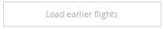
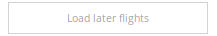

To display all data available (something like 24h of past and future departures/arrivals), we simulate multiples clic on this two buttons, and we stop this behavior only when these buttons disapears from the page.

At the end of this tutorial, we present how to use [Docker](https://www.docker.com/) container technology to export our webscrapping script on some remote server for an autonomous execution 24/24h. 

# Using Selenium server browser

## Install and use Selenium 

### The Selenium RLibrary

Due to some defense created by webmaster to protect their data (test javascript, user-agent, infinite loading, etc.), you need to simulate an human behavior, if possible using a real browser. 

To be short, [Selenium](https://docs.seleniumhq.org/) is a multi-tools project focusing on task automation to test web aplication. It works with lots of Internet browsers, and lot of operating systems.  

Selenium Webdriver give to developper an API to interact/pilot an headless internet browser without opening it. So, you, developper, you could use this API with your favorite langage (Java, Python, R, etc.) to sent commands to browser in order to navigate, move your mouse, click on DOM element, sent keyboard output to input forms, inject javascript, capture image of the page, extract html, etc.

First, you need to install and load RSelenium package, the R bindings library for Selenium Webdriver API : 

```R
install.packages("devtools")
devtools::install_github("ropensci/RSelenium")
```
Depending of your existing configuration and OS you probably need to install some dependent software packages.

It's possible to use directly Selenium in connection with your browser, but we prefer to use directly a server version. Why ? Because using server version of Selenium, you have the possibility :

a) to sent command on local or remote server running Selenium 
b) which run a different browsers and/or OS, 
c) to distribute tests over multiple machines.

Selenium is a fast moving project, and some release are really buggy, so try to choose a stable version, and don't desperate.

### Run a Selenium server

**!! Before continuing, read the documentation on Docker at the bottom of this document, it explain what is really Docker/images/container, and it explain how to install images/containers on your system !!**

When it's done, we `pull and run` [one of](https://github.com/SeleniumHQ/docker-selenium) Docker Selenium-Server image using terminal. For this tutorial we use **Firefox** !

In classic context (good internet connection), we pull images directly from the Docker Hub server, a central repository like CRAN for R.

```bash
sudo docker pull selenium/standalone-firefox:3.14.0-arsenic
```

**But, because the image is heavy in size (1 GO for the two images used in this tutorial)**, we prefer to directly load the image given by USB key by your teachers. Open a terminal on the folder where located the images.

```bash
sudo docker load --input=r-alpine.tar
sudo docker load --input=rSelenium.tar
```

Create the Selenium container which contain Firefox :

```bash
sudo docker run --shm-size=2g --name selenium -d -p 4445:4444 selenium/standalone-firefox:3.14.0-arsenic
```

Type `sudo docker ps` to see if server correctly run and listen to port **4445**

### Connect to Selenium Server

Connect and open the browser on the server.

```{r, message=FALSE, error=FALSE}

user_agent_list = c ("Mozilla/5.0 (Windows NT 6.3; rv:36.0) Gecko/20100101 Firefox/36.0", "Mozilla/5.0 (Windows NT 6.1; rv:27.3) Gecko/20130101 Firefox/27.3", "Mozilla/5.0 (X11; Linux x86_64; rv:28.0) Gecko/20100101 Firefox/28.0", "Mozilla/5.0 (Windows NT 6.2; Win64; x64;) Gecko/20100101 Firefox/20.0", "Mozilla/5.0 (Windows NT 10.0; Win64; x64) AppleWebKit/537.36 (KHTML, like Gecko) Chrome/42.0.2311.135 Safari/537.36 Edge/12.246", "Mozilla/5.0 (Windows NT 6.3; WOW64) AppleWebKit/537.36 (KHTML, like Gecko) Chrome/41.0.2226.0 Safari/537.36", "Mozilla/5.0 (Macintosh; Intel Mac OS X 10_9_0) AppleWebKit/537.36 (KHTML, like Gecko) Chrome/32.0.1664.3 Safari/537.36", "Mozilla/5.0 (Windows NT 5.1) AppleWebKit/537.36 (KHTML, like Gecko) Chrome/27.0.1453.93 Safari/537.36","Mozilla/5.0 (Windows NT 6.1) AppleWebKit/537.36 (KHTML, like Gecko) Chrome/27.0.1453.90 Safari/537.36", "Mozilla/5.0 (X11; Linux x86_64) AppleWebKit/535.11 (KHTML, like Gecko) Ubuntu/11.04 Chromium/17.0.963.56 Chrome/17.0.963.56 Safari/535.11")

fprof <- makeFirefoxProfile(list(general.useragent.override=sample(user_agent_list,1)))

remDr <- remoteDriver(remoteServerAddr = "localhost", port = 4445L, extraCapabilities = fprof )
remDr$open()
remDr$maxWindowSize()

remDr$executeScript("return navigator.userAgent;", list(""))


```

### Basic command for RSelenium

[Johnd Harrison](https://github.com/johndharrison), the creator and first commiter of RSelenium binding library for Selenium, create a big tutorial with lots of commands covered : https://rpubs.com/johndharrison/RSelenium-Basics

Some of them : 

- `remDr$maxWindowSize()` : maximize windows of the browser.
- `remDr$navigate("https://www.google.fr")` : navigate to url
- `remDr$screenshot(display = TRUE)` : take a screenshoot of the webpage and display it in RStudio Viewer
- `remDr$findElement(...)` : Find and element in the html structure, using different method : xpath, css, etc.
- `remDr$executeScript(...)` : Execute a js script in the remote browser
- `remDr$clickElement(...)` : Clic on element

## From analysis to automation

### Analysis of website HTML structure 

Open `Web Developer tools` in your favorite browser on the arrivals webpage of BOD : `https://www.flightradar24.com/data/airports/bod/arrivals`

We investigate what happens in the html code when we clic the **load earlier** or **load later** button. Why we do that ? To understand how we could automate things later.

Because we want to automate clic on this two buttons, we need to understand WHEN we need to stop clicking :) If we clic an infinite number of time, an error probably trigger when one of the two button disapear.

Select the **Selector tools** and click on the load earlier button.

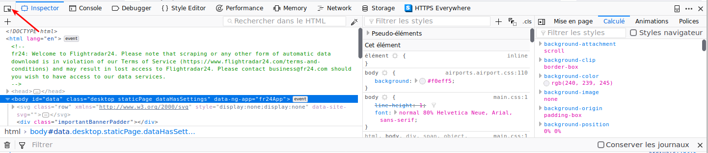

If you clic the right thing, normaly you have highlighted some part of the html code which interest us :

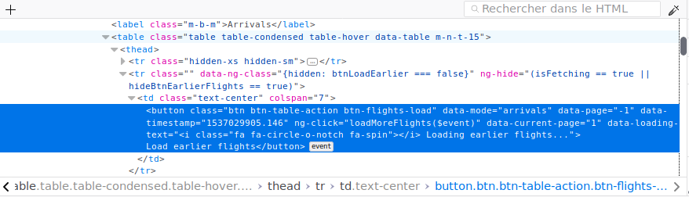

Now, Iif you highlight and clic with the web tool selector on the load later flights button, you have something like that : 

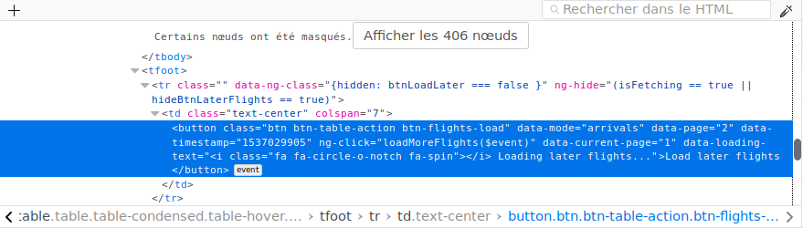

Things are not so very differences between this two buttons objects. It seems that only the timestamp, the data page number and the button text change ...

Hightlight and clic one more time on the *load earlier flights* button. Clic another time to load a new page of data. You see that the html code change during the data load to desactivate clic on the button. Not so interesting. Now repeat the clic and stop only when the button disapear on your screen. 

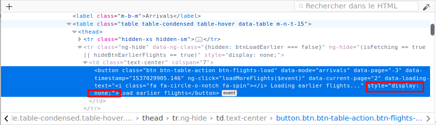

Great, a new css style attribute appear to indicate that now this button object is hidden : `style="display: none;"`

How could we re-use this important information during data harvesting to detect if the button is activated/desactivated ? The best solution was to use XPATH query !

Load the page in the selenium server 

```{r, message=FALSE}
remDr$navigate("https://www.flightradar24.com/data/airports/bod/arrivals")
Sys.sleep(5) # time to load !
remDr$screenshot(file = "screenshoot.png")
```

### Resolve infinite loading using XPath

Building XPATH correct expression could be difficult. A good way to test validity of your XPATH expressions was to use an interactive way, using the web developper console. There are some good cheatsheet pages which resume all the possibilities of XPATH : [1](https://devhints.io/xpath) [2](https://gist.github.com/LeCoupa/8c305ec8c713aad07b14)

Clic on console tab :

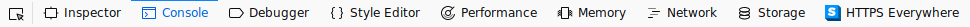

Type this in the console : `$x("//button[@class='btn btn-table-action btn-flights-load']")`

The result is an interactive array you could develop as a tree if you want.

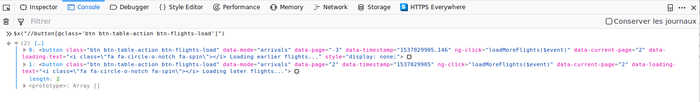

Clic Clic Clic to make disapear one of the loading button, and now we trying to select only the available button. XPATH understand boolean operator (or,and, etc.) so we filter by `@class` and `style` :

`$x("//button[@class='btn btn-table-action btn-flights-load' and contains(@style,'display: none;')]")`

Great, this query return only the valid button. We use later this query to stop our loop of infernal button clic.

Now we try to build this query using RSelenium with `findElement()` function : 

```{r, message=FALSE}
loadmorebutton <- remDr$findElements(using = 'xpath', "//button[@class='btn btn-table-action btn-flights-load' and not(contains(@style,'display: none;'))]")
```

Display the text of each element retrieved by function `findElements()` using the `getElementText() function`

```{r, message=FALSE}
unlist(lapply(loadmorebutton, function(x){x$getElementText()}))
```

Now, how to simulate a clic on one of this button ?

An easy way was to call `clickElement()` function on the first loadmorebutton webelement :

```{r, message=FALSE}
tryCatch({
suppressMessages({
  loadmorebutton[[1]]$clickElement()})},
error = function(e) {
    loadmorebutton[[1]]$errorDetails()$message
  })
```

This command return an error message (if not, you're lucky !), not very explicit, so if you want more details, you could call the function `errorDetails()` like our `trycatch` block.

An element of the webpage overlapp our button, so browser say us that's not possible to clic on this webelement. Use snapshot function to see the page : 

```{r, message=FALSE}
remDr$screenshot(file = 'screenshoot_overlap.png' )
```

If we hide these elements using XPath and javascript injection, everything goes to normal. First we accept cookies.

```{r, message=FALSE, delay = TRUE}
hideCookie <- function (x){
  cookiesButton <- x$findElement(using = 'xpath',"//div[@class='important-banner__close']") 
  cookiesButton$clickElement()
}

hideCookie(remDr)
remDr$screenshot(file = 'screenshoot_hide.png')
```

The navbar element create problem, so we hide it using javascript injection :

```{r, message=FALSE, delay = TRUE}
hideNavBar <- function (x) {
  script <- "document.getElementById('navContainer').hidden = true;"
  x$executeScript(script)
}
hideNavBar(remDr)
```

Now you can `clickElement()` without problem :)

```{r, message=FALSE}
tryCatch({
suppressMessages({
  loadmorebutton[[1]]$clickElement()})},
error = function(e) {
    remDr$errorDetails()$message
  })
```

See changes before and after using `remDr$screenshot(display = TRUE)` command

## Exercices

- Create a function which clic on button until they all disapears  :)

<button title="Click to show answer" type="button"
   onclick="if(document.getElementById('spoiler').style.display=='none')
              {document.getElementById('spoiler').style.display=''}
            else{document.getElementById('spoiler').style.display='none'}">
  Show/hide
</button>

<div id="spoiler" style="display:none">


```{r, message=FALSE}
 remDr$refresh() # reload page
 Sys.sleep(5) # time to load !
 
 hideNavBar(remDr) 
 
 searchElements <- function() { 
   elements <- remDr$findElements(using = 'xpath', "//button[@class='btn btn-table-action btn-flights-load' and not(contains(@style,'display: none;'))]")
   return(elements)
   }
 
clic <- function(x){
  print(paste("Clic on ", x$getElementText() ," button")) 
  x$clickElement()
  Sys.sleep(5) # time to load
 }
 
loadmorebutton <- searchElements()
nbElements <- length(loadmorebutton)

while( nbElements > 0)
{  
   print(paste("nb of button >", nbElements))
   lapply(loadmorebutton, clic)
   Sys.sleep(5) # time to load
   loadmorebutton <- searchElements()
   nbElements <- length(loadmorebutton)
}

remDr$errorDetails()$message

```

But we only have the number of clic and screenshot return only part of the viewer. In the next exercice we try to return all data on the page for the first result day after all these clics.

</div>

- Extract data for only one day using XPATH and Rvest !

<button title="Click to show answer" type="button"
   onclick="if(document.getElementById('spoiler2').style.display=='none')
              {document.getElementById('spoiler2').style.display=''}
            else{document.getElementById('spoiler2').style.display='none'}">
  Show/hide
</button>

<div id="spoiler2" style="display:none">

We use the already discussed library nammed `rvest` to prepare data for dataframe.

```{r, message=FALSE}

src <- remDr$getPageSource()[[1]]  %>% read_html()

searchDateElements <- function() { 
   elements <- remDr$findElements(using = 'xpath',"//*[contains(@class,'row-date-separator')]/td")
   return(elements)
}

# get the first date
flightDateElements <- searchDateElements()
flightDate <- flightDateElements[[1]]$getElementText()[[1]]

column <- function(x) src %>% html_nodes(xpath = x) %>% html_text(trim=TRUE)

df <- data.frame(
  hour = column(paste("//tr[@data-date='",flightDate,"']//td[1]/text()",sep="")),
  from = column(paste("//tr[@data-date='",flightDate,"']//span[@class='hide-mobile-only ng-binding']/text()",sep="")),
  code = column(paste("//tr[@data-date='",flightDate,"']//div[@ng-show='(objFlight.flight.airport.origin)']//a//text()",sep="")),
  airline = column(paste("//tr[@data-date='",flightDate,"']//td[@class='cell-airline']//a//text()",sep="")),
  plane = column(paste("//tr[@data-date='",flightDate,"']//span[@class='notranslate ng-binding']/text()",sep="")),
  planecode =column(paste("//tr[@data-date='",flightDate,"']//a[@ng-show='(objFlight.flight.aircraft.registration)']//text()",sep="")),
  info = column(paste("//tr[@data-date='",flightDate,"']//td[7]",sep="")),
  stringsAsFactors = FALSE
)

kable(df,caption ="results of webscraping")

```

</div>

# Scrap using XHR requests

## Analyse Network data in browser 

Sometimes, a defense is also a point of vulnerability. Many site use some sort of internal API to query and feed their website, it's an easy way for developpers to distribute the data. But for us, this is also a perfect data [SOF (Single Point Of Failure)](https://en.wikipedia.org/wiki/Single_point_of_failure). 

We try to see if this is the case with flight radar :)

Open the dev tools in the browser, clic on **Network** tab, then **XHR** tab.

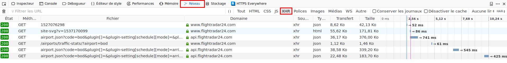

Lucky guy/girl, do you see it ? Each `GET` query call an `aiport.json` file on the server :

`https://api.flightradar24.com/common/v1/airport.json?code=bod&plugin[]=&plugin-setting[schedule][mode]=&plugin-setting[schedule][timestamp]=1537297562&page=1&limit=100&token=`

If we decompose the query, we have :

- an airport code : **bod**
- a timestamp : **1537297562**
- a page number : **1**
- a limit by page : **100**

Copy paste this url in your browser to see how the result json is structured. Insteresting data is located into schedule `result > response > airport > arrivals` : 

- **item :** number of total items
- **page :** actual page and number of page 
- **timestamp :** date of capture
- **data :** a list of 100 flights corresponding to actual page

## Generate a custom GET Query

We have the capacity to generate custom query to download data at custom timestamp. This query return data structured in json , so we try to convert this data to data.frame using the jsonlite wonderfull package :) Why wonderfull ? Because jsonlite had an option to flatten the structure of json which normally contain data.frame into data.fram into data.frame ... 

```{r, message=FALSE}

timestamp <- as.numeric(as.POSIXct(now()))

url <- paste("https://api.flightradar24.com/common/v1/airport.json?code=bod&plugin[]=&plugin-setting[schedule][mode]=&plugin-setting[schedule][timestamp]=",timestamp,"&page=1&limit=100&token=",sep="")

# https://cran.r-project.org/web/packages/jsonlite/vignettes/json-aaquickstart.html
json <- jsonlite::fromJSON(url,flatten = T) 
```

We extract information for the first page of Arrivals data collected by airport from json.

```{r, message=FALSE}
pageOfData <- json$result$response$airport$pluginData$schedule$arrivals$data 
filteredData <- pageOfData %>% select(flight.airline.code.icao, flight.airline.name, flight.airport.origin.name, flight.airport.origin.code.icao, flight.airport.origin.position.latitude, flight.airport.origin.position.longitude) 

filteredData <- rename(filteredData, c(flight.airline.code.icao = "ICAO", flight.airline.name= "Name", flight.airport.origin.name = "Origin", flight.airport.origin.code.icao="Origin ICAO", flight.airport.origin.position.latitude = "Latitude",flight.airport.origin.position.longitude = "Longitude" ))

knitr::kable(filteredData, caption = "page 1 of arrival for BOD")

```

## Exercices

- Get all pages of arrivals data by generating the correct query to API :)

# Automation of scraping using Docker containers !

## Why ?

This is the ultimate and probably the most complex part of this big tutorial.

In real webscraping project, there are two possible use case : 

- a one shoot data harvesting or  
- a daily/monthly/etc. data harvesting.

Take a very practical example, if you need to collect **one year of data on a daily basis** you cannot use your personnal computer. You need to connect and run your program from a distant server (somewhere on internet).

## What is Docker ?

To be really really short on subject, [Docker](https://en.wikipedia.org/wiki/Docker_(software)) is a technology which encapsulate one or multiple software with all theirs dependencies into an isolated (and if possible immutable) container which run on top of any system interoperable with Docker tools (Window/Linux/Mac). You could run multiple isolated containers (A, B , ...), with capacity to exchange informations using a common dedicated local network, on the same machine. 

<center>

</center>

It was a very interesting technology because **if you develop a program in a container on your local machine, it works on any server compatible with Docker.** If you know the concept of [Virtual Machine (VM)](https://en.wikipedia.org/wiki/Virtual_machine), the idea is the same, but Docker is a **more efficient** technology (see this [comparison](https://www.docker.com/resources/what-container) on Docker official documentation).

<center>

</center>

Lena create an independent container which contain : 

- the software
- the dependencies, libraries, etc. 
- the data collected or needed by software

Two use case are possible : 

- If Lena want to share container `MyContainer` to paul, she (command `docker export --output myContainer.tar myContainer`) the container on a USB key. Later, Paul copy and load the container `MyContainer`on his machine (command `docker load`).   

- If Lena want to run `MyContainer` container on some server on the web which contain docker program, she export the container(command `docker --output myContainer.tar myContainer`), copy this container on the server (using FTP protocol for example) and load this container (command `docker load --input myContainer.tar`) on the server.  

**Be careful 1 ** if your container contain a Volume you need a special procedure to migrate it. 

**Be careful 2 ** If your container need another container to work, you need to export both.

Here we are, we use this **[Docker](https://www.docker.com/) technology** to encapsulate our webscrapping script into one **portable** container. After that you could save yours and launch it on any webserver which run Docker.

There are three big step to understand in containers lifecycle: 

- First, we describe the composition of an **image** into a **Dockerfile** file using a special Docker syntax. **It's like a recipe into cookbook.** For example, you could find lot of recipes for general software on this site : [DockerHub](https://hub.docker.com/explore/).

- Next, like a recipe in the real life, you need to concretize this recipe into some delicious cake. Image need to be built before usage. From an **Image/Recipe of a cake** we create a **Container/Cake**

- Finally, you **run** the builted image.

You could find lot of other informations on the web, but also on this [online tutorial](https://hackmd.io/s/SylAFG_Kf#) which resume lot of commands.  

In this tutorial, we give you the corresponding `Dockerfile` which contain the recipe to build a `Container` ready to scrape the flightradar website. All script to do that are in `docker-scripts` folder.

At the end of the tutorial you have this architecture, with two container (RSelenium and Flightscrapradar) which communicate to scrap data on flightradar website.

<center>

</center>

## Installing Docker 

### Linux way

On linux Ubuntu, you found documentation [here](https://docs.docker.com/install/linux/docker-ce/ubuntu/). First step, install the key and repository. 

```bash
sudo apt-get install \
    apt-transport-https \
    ca-certificates \
    curl \
    software-properties-common
```

Add key and repository : 

```bash
curl -fsSL https://download.docker.com/linux/ubuntu/gpg | sudo apt-key add -

sudo add-apt-repository \
   "deb [arch=amd64] https://download.docker.com/linux/ubuntu \
   $(lsb_release -cs) \
   stable"

sudo apt-get update
```

Install docker-ce :

```bash
sudo apt-get install docker-ce
```

You are ready to jump to the tutorial which correspond to your OS.

### Windows and Mac Way

There are two way to install Docker for Windows and Mac, a new way [Windows](https://docs.docker.com/docker-for-windows/) / [Mac](https://docs.docker.com/docker-for-mac/) and an old way. For this tutorial we use the the old way due to better compatibility.

Install Docker Tools for windows using the `DockerToolbox.exe` (or `.dmg` for mac) file. You could find the official documentation is available here [Windows]( https://docs.docker.com/toolbox/toolbox_install_windows/) and [Mac](https://docs.docker.com/toolbox/toolbox_install_mac/)

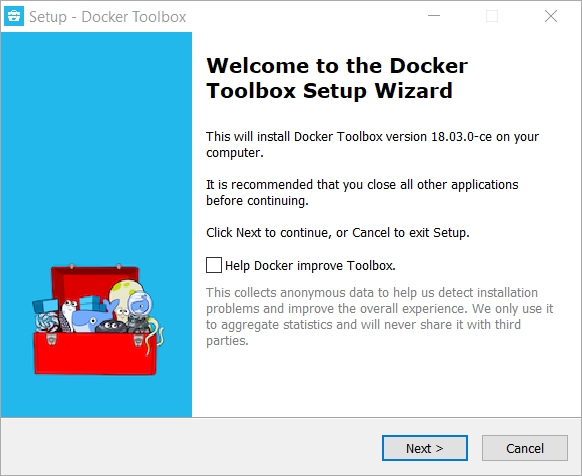

After that you could launch Docker quickstart terminal directly after installation or using the icon in start menu. 

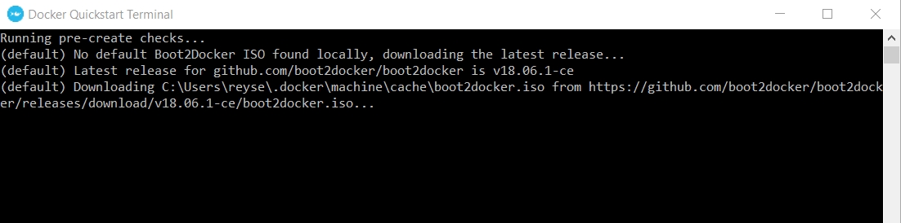

Docker first download an iso, and after that test if your system is ready to run containers. If you see an error like this, you need to run another step. 

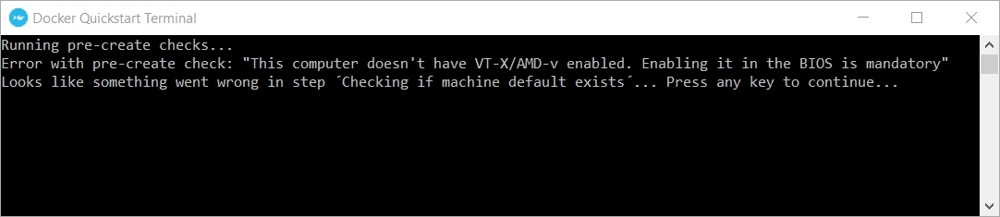

Restart your computer, and try to activate an option in the BIOS (Del key during initialization of your computer) probably named "Vanderpool technology" or "VT-X technology" or "Virtualization technology". Save and restart. Some pictore for UEFI Bios on HP, DELL, ASUS motherboard/systems.

*Asus*

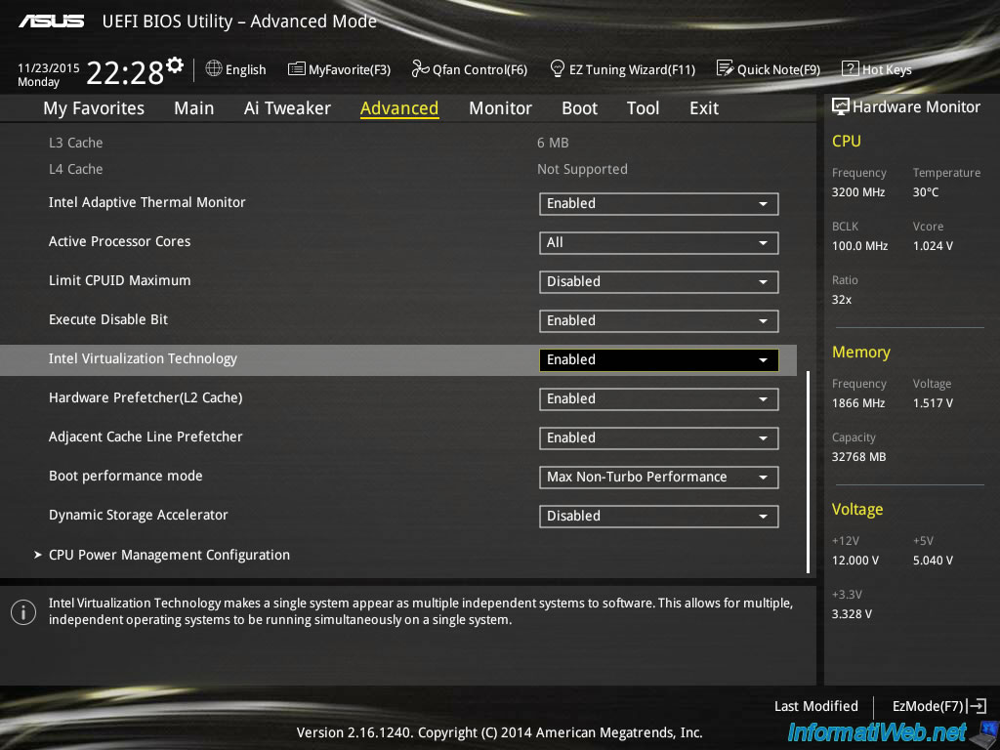

*Dell* 


*HP*


You are ready to jump to the tutorial which correspond to your OS.

## Tutorial Docker / Linux

Copy the folder `docker-images` on the USB Key (ask teachers) into the `scrap-flightradar` folder of this tutorial. 

Now, go to this folder using terminal command (`cd pathofthefolder`), and load the two images on your system.

```bash
sudo docker load --input=r-alpine.tar
sudo docker load --input=rSelenium.tar
```

**BUILD image**

Go to `docker-scripts` folder into the folder which contain this tutorial on your disk.

The building of this image take lot of times (ten minutes), this is due to the huge dplyr library. Run the `docker build` command in the folder which contain the `Dockerfile` description of the image.

```bash
docker build . --tag=rflightscraps
```

**LAUNCH Container**

a) Using a **binded volume**, this is the easiest way actually. Open your terminal, go to the folder of your script. Create a new folder named `localbackup` and run the container `rflightscraps` with correct path.

```bash
mkdir localbackup
docker run --name rflightscraps -d -e UID=1000 -e GID=1000 --mount type=bind,source=$(pwd)/localbackup,destination=/usr/local/src/flight-scrap/docker-scripts/data rflightscraps
```

To see if your container is running and consult the logs of execution : 

```bash
sudo docker ps
sudo docker logs rflightscraps
```

To consult the result of automatic harvesting, consult the `docker-scripts/localbackup` folder using `ls` unix command. You see a list of csv which correspond to harvest made every minute. If you want to change this, you need to modify the `crontab` file following the [cron syntax](https://crontab.guru/#*_*_*_*_*), and rebuild/relaunch the image (it take less time, because you only modify one file, no need to recompile).


b) Same thing, but using a *named volume*, a more portable way to share data between docker container, but it lacks some features on permissions to correctly export data.

Create a named volume, independent from filesystem

```bash
docker volume create --name myDataVolume
docker volume ls
```

Mount the volume : 

```bash
docker run --mount type=volume,source=myDataVolume,destination=/usr/local/src/flight-scrap/docker-scripts/data rflightscraps
```

Export data  : 

- Using a `alpine` image, we mount the named volume (`myDataVolume`) to a `/alpine_data` folder inside the `alpine` container.
- Then, we create a new folder inside the `alpine` container named `/alpine_backup`.
- We then create an archive containing the contents of the `/alpine_data` folder and we store it inside the `/alpine_backup` folder (inside the container).
- We also mount the `/alpine_backup` folder from the container to the docker host (your local machine) in a folder named `/local_backup` inside the current directory.

```docker run --rm -v myDataVolume:/alpine_data -v $(pwd)/local_backup:/alpine_backup alpine:latest tar cvf /alpine_backup/scrap_data_"$(date '+%y-%m-%d')".tar /alpine_data```

**EXPORT Containers**

<center>

</center>

If you don't have a server yet, you could buy one with docker already installed for cheap / month :
- https://www.digitalocean.com/products/one-click-apps/docker/
- https://www.ovh.com/fr/vps/vps-cloud.xml

  <asciinema-player src="203002.cast" cols="106" rows="53"></asciinema-player>

## Tutorial Docker / Windows & Mac 

**PREPARE image**

Copy `docker-scripts` and `docker-images` folders into `c:\Program Files\Docker Toolbox`

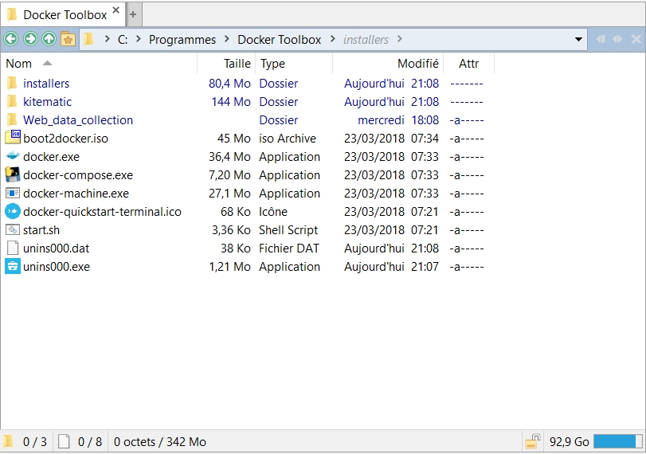

After that, into Terminal of Docker Toolbox you see this folders.

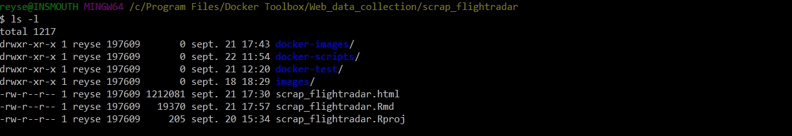

Go to `docker-images` folder using `cd` command, and load the two images :

```bash
docker load --input=r-alpine.tar
docker load --input=rSelenium.tar
```

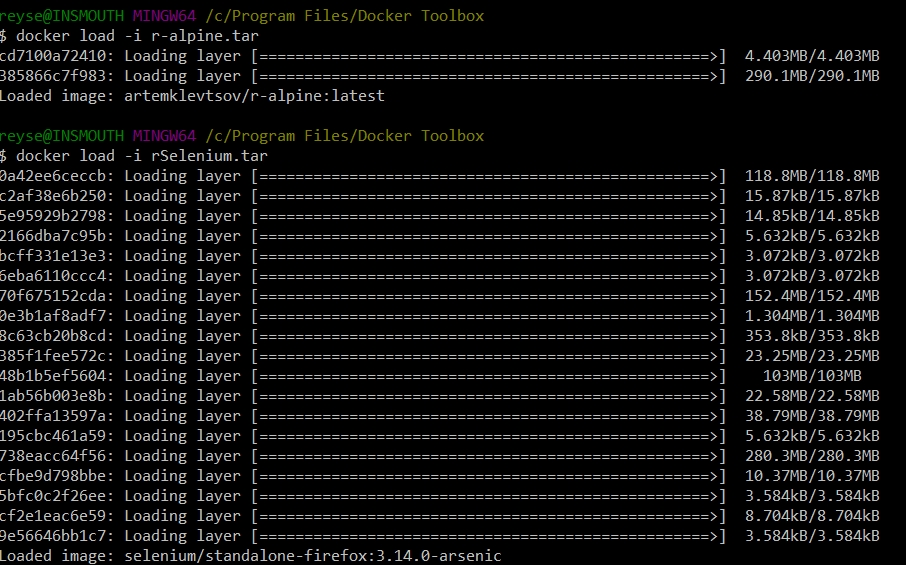

**BUILD image**

Go to `docker-scripts` folder into the folder which contain this tutorial on your disk.

The building of this image take lot of times (ten minutes), this is due to the huge dplyr library. Run the `docker build` command in the folder which contain the `Dockerfile` description of the image.

```bash
docker build . --tag=rflightscraps
```

**LAUNCH container**

We use a **binded volume**, this is the easiest way actually. 

First, create a new folder named `localbackup` into your users folder on windows : `C:\Users\yourname` 
After that, change the path by yours in this command and run it.

```bash
docker run --name rflightscraps -d -e UID=1000 -e GID=1000 --mount type=bind,source=/c/Users/reyse/localbackup,destination=/usr/local/src/flight-scrap/docker-scripts/data rflightscraps 
```

The end, close the session !

```{r, message=FALSE}
remDr$close()
```

