--- 
title: "Web scraping with R"
author: "Lise Vaudor / Sébastien Rey-Coyrehourcq / Fabien Pfaender"
output:
  slidy_presentation:
    css: css/styles.css
    footer: 'Web scraping: tools'
  ioslides_presentation: default
---

```{r load_packages, message=FALSE, warning=FALSE, include=FALSE} 
library(fontawesome)
```

```{r setup, include=FALSE}
knitr::opts_chunk$set(echo = TRUE, warning=FALSE, message=FALSE)
library(tidyverse)
library(purrr)
library(rvest)
```

# Today !

- Webscraping, what is this ?
- Some ethicals considerations
- A theoritical HTML page
    - Read Html using rvest
    - How manipulate data efficiently (purrr, string)
    - How-to extract link & data from HTML (Regex, CSS, XPath)
- A cat and mouse game :) 
- Uses cases

# Webscraping 

- definition
- some elements of web architecture 

# Ethics, some elements of reflexion.

**In two words**

  - Grey Zone !! Heavily dependent of your country and the site you scrap !
  - Law is clearly not so clear, but now RGPD include **derogations** for researchers
  - Contact CNIL (France) or [similar institute in your country](https://www.cnil.fr/fr/la-protection-des-donnees-dans-le-monde), they will help you !
  - **Don't publish any data on the web** before anonymisation !
  - Collect data limited to your project
  - Protect personnal data very seriously (data-center, encrypted, firewall protection, etc.)

**In more than two words ...**

  - Read new European Law : GPDR or RGPD (not a joke, not so hard to read)
  - Read this starting paper writed on this subject for this school :
https://hackmd.io/g9JrWURjTHyLr9EWQqKoiQ?both
  - Be inspirated by [existing case of scrapping](https://www.legifrance.gouv.fr/affichCnil.do?id=CNILTEXT000036945250) or other discipline (medecine)

# Packages

<div class="left">
- 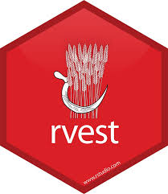`rvest`: web scraping
- 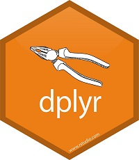`dplyr`: table-wrangling
- `stringr`: strings
- 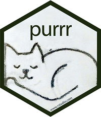`purrr`: iteration
</div>

# A theoretical example of Web scraping

<div class="left">

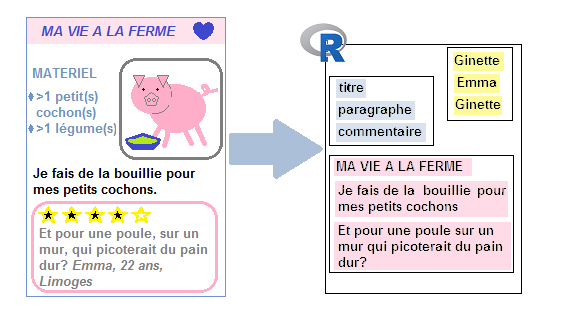


<div class="left">

{width=80%}

</div>

<div class="right">

**HTML Document**

Understanding html documents' structure

Tools **SelectorGadget**
or html inspector
</div>


</div>
<div class="right">

Package **rvest**:
 

To **collect the contents of a web page**, one has to:

- **read an html page** in R
- **get the element of interest** in the page (basic html, [SelectorGadget](https://cran.r-project.org/web/packages/rvest/vignettes/selectorgadget.html))
- **parse** the page
- **select an element** of the page
- **get the contents** of the element

</div>

# html tags

<div class="left" margin-left:40%>
    <html>
    <style>
    h1 {background-color: powderblue;}
    .image {margin-left:50%;}
    .comment{border-style:solid; background-color:LemonChiffon;}
    .comment-author{font-style: italic;}
    </style>
    <h1> MA VIE A LA FERME </h1>
    <div class="ingredients">
      <b> INGREDIENTS</b>
      <ul>
        <li> >1 cochon(s) </li>
        <li> >1 légume(s) </li>
      </ul>
    </div>
    <div class="right"><div class="image">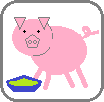</div></div>
    <p> Je fais de la bouillie pour mes petits cochons.</p>
    <p> Pour un cochon, pour deux cochons, pour trois cochons, pour quatre, puis pour cinq, pour six, pour sept, pour huit, pour neuf, boeuf! </p>
    <b>comments</b>
    <div class="comment">Et pour une poule sur un mur qui picoterait du pain dur?
    </div>
    <div class="comment-author">Emma, 22 ans, Limoges</div>
    <div class="comment">Je vois que vous êtes, telle la petite poule rousse, bien aimable. Avez-vous pu compter sur l'aide du chat et du canard pour semer vos 5 grains de blé?</div>
    <div class="comment-author">Michel, 56 ans, Rennes</div>
    </html>

</div>

<div class="right">
<iframe src='data/blog_de_ginette.htm' width='500' height='500'></iframe>
</div>

# Read an html page

<div class="left" margin-left:40%>
    <html>
    <style>
    h1 {background-color: powderblue;}
    .image {margin-left:50%;}
    .comment{border-style:solid; background-color:LemonChiffon;}
    .comment-author{font-style: italic;}
    </style>
    <h1> MA VIE A LA FERME </h1>
    <div class="ingredients">
      <b> INGREDIENTS</b>
      <ul>
        <li> >1 cochon(s) </li>
        <li> >1 légume(s) </li>
      </ul>
    </div>
    <div class="right"><div class="image"></div></div>
    <p> Je fais de la bouillie pour mes petits cochons.</p>
    <p> Pour un cochon, pour deux cochons, pour trois cochons, pour quatre, puis pour cinq, pour six, pour sept, pour huit, pour neuf, boeuf! </p>
    <b>comments</b>
    <div class="comment">Et pour une poule sur un mur qui picoterait du pain dur?
    </div>
    <div class="comment-author">Emma, 22 ans, Limoges</div>
    <div class="comment">Je vois que vous êtes, telle la petite poule rousse, bien aimable. Avez-vous pu compter sur l'aide du chat et du canard pour semer vos 5 grains de blé?</div>
    <div class="comment-author">Michel, 56 ans, Rennes</div>
    </html>

</div>

<div class="right">

Read html page in R:  
```{r}
library(rvest)
html=read_html("data/blog_de_ginette.htm", encoding="UTF-8")
html
```

</div>

# Extract some elements in the html page

<div class="left" margin-left:40%>
    <html>
    <style>
    h1 {background-color: powderblue;}
    .image {margin-left:50%;}
    .comment{border-style:solid; background-color:LemonChiffon;}
    .comment-author{font-style: italic;}
    </style>
    <h1> MA VIE A LA FERME </h1>
    <div class="ingredients">
      <b> INGREDIENTS</b>
      <ul>
        <li> >1 cochon(s) </li>
        <li> >1 légume(s) </li>
      </ul>
    </div>
    <div class="right"><div class="image"></div></div>
    <p> Je fais de la bouillie pour mes petits cochons.</p>
    <p> Pour un cochon, pour deux cochons, pour trois cochons, pour quatre, puis pour cinq, pour six, pour sept, pour huit, pour neuf, boeuf! </p>
    <b>comments</b>
    <div class="comment">Et pour une poule sur un mur qui picoterait du pain dur?
    </div>
    <div class="comment-author">Emma, 22 ans, Limoges</div>
    <div class="comment">Je vois que vous êtes, telle la petite poule rousse, bien aimable. Avez-vous pu compter sur l'aide du chat et du canard pour semer vos 5 grains de blé?</div>
    <div class="comment-author">Michel, 56 ans, Rennes</div>
    </html>
</div><div class="right">

**Extract** some elements ("nodes" or "nodesets"):

```{r}
html_nodes(html,"b")
html_nodes(html,".comment-author") 
html_nodes(html,".ingredients") %>% 
  html_children()
```
</div>

# Extract the type of some elements

<div class="left">
    <html>
    <style>
    h1 {background-color: powderblue;}
    .image {margin-left:50%;}
    .comment{border-style:solid; background-color:LemonChiffon;}
    .comment-author{font-style: italic;}
    </style>
    <h1> MA VIE A LA FERME </h1>
    <div class="ingredients">
      <b> INGREDIENTS</b>
      <ul>
        <li> >1 cochon(s) </li>
        <li> >1 légume(s) </li>
      </ul>
    </div>
    <div class="right"><div class="image"></div></div>
    <p> Je fais de la bouillie pour mes petits cochons.</p>
    <p> Pour un cochon, pour deux cochons, pour trois cochons, pour quatre, puis pour cinq, pour six, pour sept, pour huit, pour neuf, boeuf! </p>
    <b>comments</b>
    <div class="comment">Et pour une poule sur un mur qui picoterait du pain dur?
    </div>
    <div class="comment-author">Emma, 22 ans, Limoges</div>
    <div class="comment">Je vois que vous êtes, telle la petite poule rousse, bien aimable. Avez-vous pu compter sur l'aide du chat et du canard pour semer vos 5 grains de blé?</div>
    <div class="comment-author">Michel, 56 ans, Rennes</div>
    </html>
</div><div class="right">

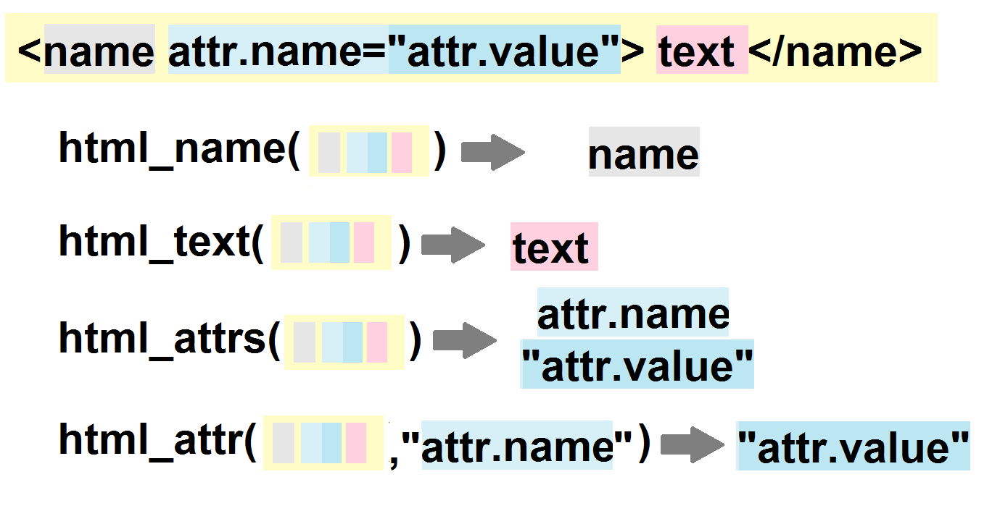

**Extract the type** of nodes or nodesets:

```{r}
html_nodes(html,".image") %>% 
  html_name()
```

</div>

# Extract the content of some elements

<div class="left">
    <html>
    <style>
    h1 {background-color: powderblue;}
    .image {margin-left:50%;}
    .comment{border-style:solid; background-color:LemonChiffon;}
    .comment-author{font-style: italic;}
    </style>
    <h1> MA VIE A LA FERME </h1>
    <div class="ingredients">
      <b> INGREDIENTS</b>
      <ul>
        <li> >1 cochon(s) </li>
        <li> >1 légume(s) </li>
      </ul>
    </div>
    <div class="right"><div class="image"></div></div>
    <p> Je fais de la bouillie pour mes petits cochons.</p>
    <p> Pour un cochon, pour deux cochons, pour trois cochons, pour quatre, puis pour cinq, pour six, pour sept, pour huit, pour neuf, boeuf! </p>
    <b>comments</b>
    <div class="comment">Et pour une poule sur un mur qui picoterait du pain dur?
    </div>
    <div class="comment-author">Emma, 22 ans, Limoges</div>
    <div class="comment">Je vois que vous êtes, telle la petite poule rousse, bien aimable. Avez-vous pu compter sur l'aide du chat et du canard pour semer vos 5 grains de blé?</div>
    <div class="comment-author">Michel, 56 ans, Rennes</div>
    </html>
</div><div class="right">


**Extract the content** of nodes or nodesets:

```{r}
html_nodes(html,"b") %>% 
  html_text() 
```


</div>


# Extract the attributes of some elements

<div class="left">
    <html>
    <style>
    h1 {background-color: powderblue;}
    .image {margin-left:50%;}
    .comment{border-style:solid; background-color:LemonChiffon;}
    .comment-author{font-style: italic;}
    </style>
    <h1> MA VIE A LA FERME </h1>
    <div class="ingredients">
      <b> INGREDIENTS</b>
      <ul>
        <li> >1 cochon(s) </li>
        <li> >1 légume(s) </li>
      </ul>
    </div>
    <div class="right"><div class="image"></div></div>
    <p> Je fais de la bouillie pour mes petits cochons.</p>
    <p> Pour un cochon, pour deux cochons, pour trois cochons, pour quatre, puis pour cinq, pour six, pour sept, pour huit, pour neuf, boeuf! </p>
    <b>comments</b>
    <div class="comment">Et pour une poule sur un mur qui picoterait du pain dur?
    </div>
    <div class="comment-author">Emma, 22 ans, Limoges</div>
    <div class="comment">Je vois que vous êtes, telle la petite poule rousse, bien aimable. Avez-vous pu compter sur l'aide du chat et du canard pour semer vos 5 grains de blé?</div>
    <div class="comment-author">Michel, 56 ans, Rennes</div>
    </html>
</div><div class="right">


**Extract the attributes** of nodes or nodesets:

```{r}
html_nodes(html,"div") %>% 
  html_attrs()
```
</div>


# Rectangular format, and function-ization

<div class="left">
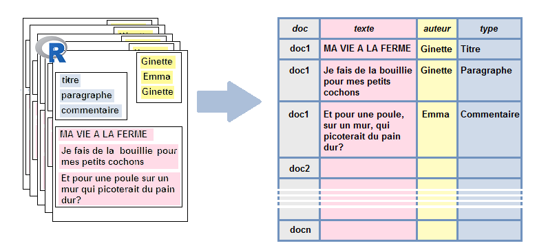

Extract data and make it into a table:

```{r}
page="data/blog_de_ginette.htm"
html=read_html(page, encoding="UTF-8")
texte=html %>% html_nodes(".comment") %>% html_text()
auteur=html %>% html_nodes(".comment-author") %>% html_text()
tib_comments=tibble(texte,auteur)
tib_comments
```

</div><div class="right">

It is actually a good idea to make all this into a fonction that would have the page's url as intput and the tibble as output:

```{r}
extract_comments=function(page){
  html=read_html(page, encoding="UTF-8")
  texte=html %>% html_nodes(".comment") %>% html_text()
  auteur=html %>% html_nodes(".comment-author") %>% html_text()
  tib_comments=tibble(doc=rep(page,length(texte)),
                          texte,
                          auteur)
  return(tib_comments)
}

extract_comments("data/blog_de_ginette.htm")
extract_comments("data/blog_de_jean-marc.htm")
```
</div>

# Iteration 

<div class="left">


Now, let's imagine that we actually have to deal with several pages **with a common structure**.

We would like to apply `extract_comments()` iteratively to all these pages.

</div><div class="right">
The `purrr` package enables us to **apply a function iteratively** to all elements of a list or of a vector (... of course this is just a more straightforward way to loop through a `for` structure...).

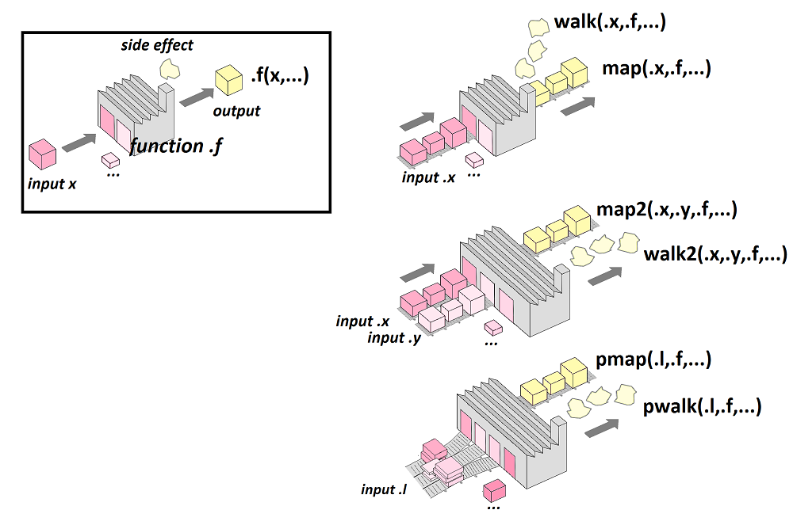
</div>

# Iteration with purrr

<div class="left">
```{r}
pages=c("data/blog_de_ginette.htm",
        "data/blog_de_jean-marc.htm",
        "data/blog_de_norbert.htm")

list_comments=map(pages, extract_comments)
list_comments
```
</div>
<div class="right">
```{r}
tibtot_comments <- list_comments %>%
  bind_rows()
tibtot_comments
```

```{r, echo=FALSE}
write_csv(tibtot_comments, "data/tibtot_comments.csv")
```
</div>

# Manipulate strings: package stringr


Package **stringr**
Blog post (in French) [here](http://perso.ens-lyon.fr/lise.vaudor/manipuler-des-strings-avec-r/).

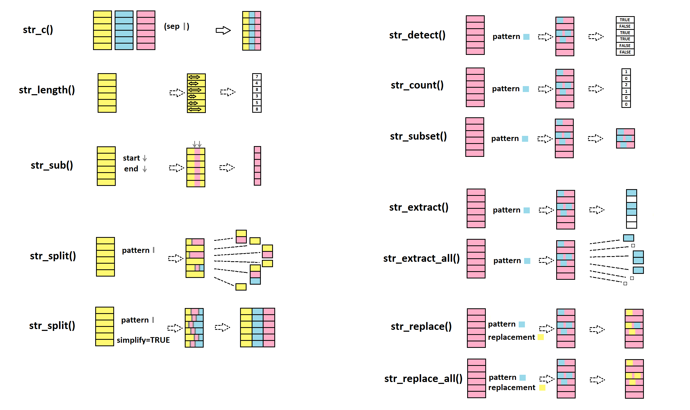{width=70%}


# Strings: concatenate, replace pattern


<div class="left">
**str_c()** to combine strings


```{r}
str_c("abra","ca","dabra")
str_c("Les jeux","de mots laids","sont pour","les gens bêtes", sep=" ")
```
</div>
<div class="right">
**str_detect()** detects a pattern

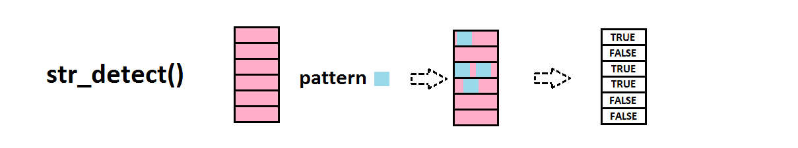
```{r}
str_detect(c("Quarante","carottes","crues",
             "croient","que","croquer",
             "crée","des","crampes."),
           pattern="cr")
```
</div>


# Strings: replace pattern, extract pattern
<div class="left">
**str_replace()** replaces a pattern with another


```{r}
str_replace(c("All we hear is",
              "Radio ga ga",
              "Radio goo goo",
              "Radio ga ga"),
            pattern="goo",
            replacement="ga")
```

</div>
<div class="right">

**str_extract()** extracts the pattern (if it's there!)

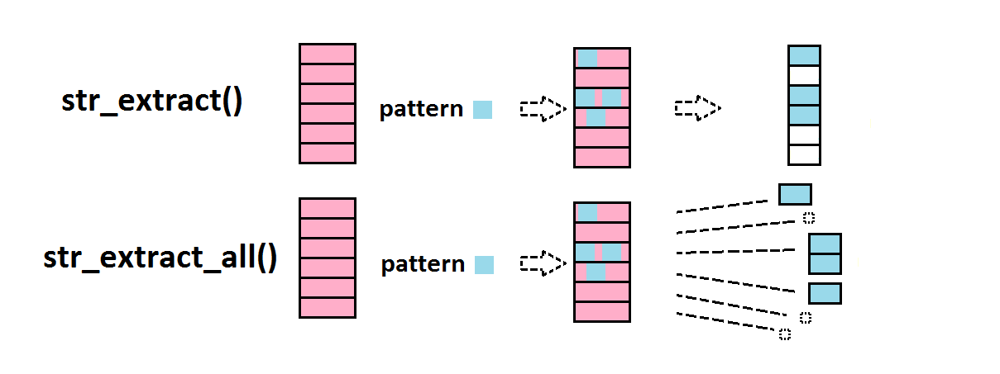

</div>
<div class="right">

```{r}
str_extract(c("L'âne","Trotro","trotte","à une allure","traitreusement","tranquille"),
           pattern="tr")
```

</div>

# Regular expressions

**Regular expressions** are used to define **patterns** through **rules of construction**.[A tutorial here](http://stringr.tidyverse.org/articles/regular-expressions.html)

{width=70%}.


# Regexp: character classes and groups

<div class="left">
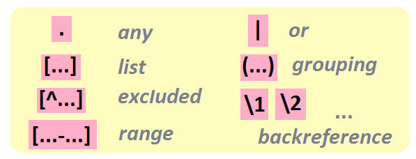

A **character class** corresponds to the notation `[...]`.

For instance, to detect all voyels in the string:
```{r}
str_view_all("youp la boum",
             "[aeiou]")
```

</div>
<div class="right">

See the difference:

```{r}
str_view_all("A132-f445-e34-C308-M9-E18",
             "[308]")
str_view_all("A132-f445-e34-C308-M9-E18",
             "308")
```

**Any character** can be noted `.`.

For instance, the pattern "any character followed by a letter" can be searched through

```{r}
str_view_all("32a-B44-552-98eEf",
             ".[a-z]")
```
</div>

# Regexp: special characters

<div class="left">
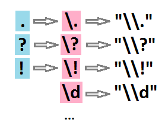

To find dots, question marks, exclamation marks:

```{r}
str_view_all(c("Allô, John-John? Ici Joe la frite. Surprise!"),
             "[\\.\\?\\!]")
```

Note that we don't write `"[.?!]"`, but `"[\\.\\?\\!]"`.

</div>
<div class="right">


`.` (as we saw before), as well as `?` and `!` are **special characters**. So, to point out *actual* dots or interrogation/exclamation marks, one has to use the escape character `\`. The regular expression hence becomes `[\.\?\!]`... 

But it does not end here... as it is not *directly* the regular expression that is passed to the function, but a *string* that is *interpreted as a regular expression*. Thus each escape character `\` has to be escaped through a `\`. So that the pattern passed to the function is actually `"[\\.\\?\\!]"`.
</div>

# Regexp: excluded characters, character ranges

<div class="left">
A character class can be defined as all characters **excluding the ones listed**. This is noted as `[^...]`:

For instance, all characters that are neither a vowel nor a blank space:

```{r}
str_view_all("turlututu chapeau pointu",
             "[^aeiou ]")
```

</div>
<div class="right">

Ranges of characters are noted `[...-...]`

For instance, all numbers between 1 and 5:

```{r}
str_view_all(c("3 petits cochons", "101 dalmations", "7 nains"),
             "[1-5]")
```

... or all those between A-F or a-e:

```{r}
str_view_all("A132-f445-e34-C308-M2244-Z449-E18",
             "[A-Fa-e]")
```
</div>

# Regexp: predefined classes

<div class="left">
Some character classes are predefined for instance **digits**, **punctuation characters**, **lower-case alphabetical characters**, etc.

</div>
<div class="right">
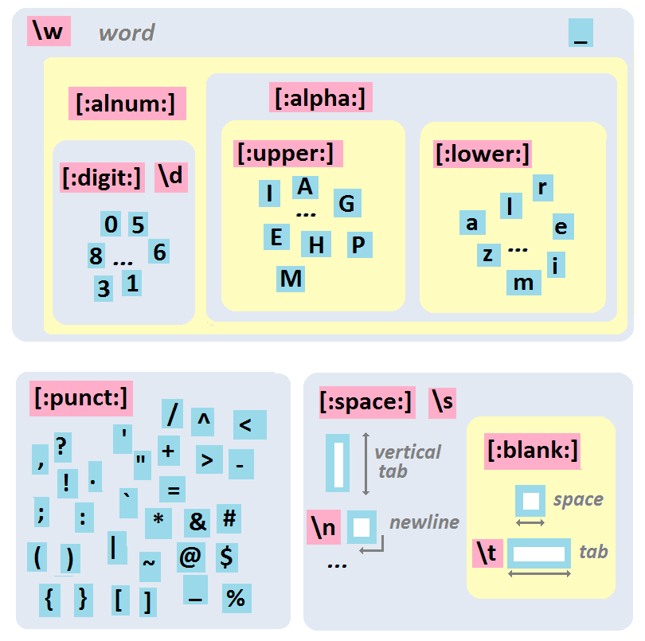
</div>
# Regexp: quantifiers

<div class="left">
Quantifiers are used to specify **how many consecutive times** a particular class or group occurs.

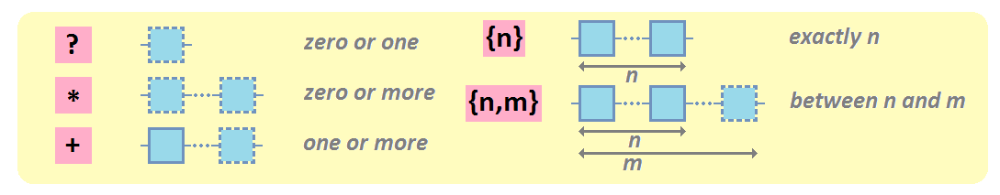

**zero or one**: the pattern of interest is followed by `?`.

```{r}
str_view_all(c("file1990-fileB1990-fileAbis2005"),
             "file\\d?")
```


</div>
<div class="right">
**zero or more**: O the pattern of interest is followed by `*`.

```{r}
str_view_all(c("file1990-fileB1990-fileAbis2005"),
             "file\\d*")
```

**one or more** :  the pattern of interest is followed by `+`.

```{r}
str_view_all(c("file1990-fileB1990-fileAbis2005"),
             "file\\d+")
```

</div>

# Xpath

XPATH is another way to query the DOM, it's very powerfull, but also a little complex.

**Some examples :**

```{r}
html_nodes(html, xpath = "//div[@class='ingredients']//ul//li")
```

```{r}
html_nodes(html, xpath = "//text()[contains(.,'cochons') and not(contains(.,'poule'))]")
```

```{r}
html_nodes(html, xpath = "//div[@class='comment']")
```

# A  and  game (1)

**How to defend from webscraping : **

Legend : {`r fa("star", fill = "orange")` : cost, difficulty to implement } , {`r fa("star", fill = "red")` : dificulty to bypass } , { `r fa("smile", fill = "black")` or `r fa("frown", fill = "black")`  : user happiness }

- change or randomize some internal structure of HTML pages (`r fa("star", fill = "red")` `r fa("star", fill = "red")` / `r fa("star", fill = "orange")` `r fa("star", fill = "orange")` `r fa("star", fill = "orange")` / `r fa("smile", fill = "black")` )
- sample, limits data displayed in time/quantity (`r fa("star", fill = "red")` `r fa("star", fill = "red")` `r fa("star", fill = "red")`/ `r fa("star", fill = "orange")` / `r fa("frown", fill = "black")`)
- use really weird Captcha (`r fa("star", fill = "red")` / `r fa("star", fill = "orange")` / `r fa("frown", fill = "black")`)
- insert all informations into image, remove textual information  ( `r fa("star", fill = "red")` / `r fa("star", fill = "orange")` `r fa("star", fill = "orange")` / `r fa("frown", fill = "black")` )
- ask authentification before display any informations (`r fa("star", fill = "red")` / `r fa("star", fill = "orange")` / `r fa("smile", fill = "black")`)
- add a signature invisible in the content (honey pot) (`r fa("star", fill = "red")` `r fa("star", fill = "red")`/ `r fa("star", fill = "orange")` `r fa("star", fill = "orange")`/ `r fa("smile", fill = "black")`)
- slowing at infinite the download of the content (`r fa("star", fill = "red")` `r fa("star", fill = "red")` / `r fa("star", fill = "orange")` `r fa("star", fill = "orange")` / `r fa("smile", fill = "black")`)
- device/browser fingerprinting (`r fa("star", fill = "red")` `r fa("star", fill = "red")` / `r fa("star", fill = "orange")` / `r fa("smile", fill = "black")`  )
- pay company to do part of this, ex: cloudflare (`r fa("star", fill = "red")` / `r fa("star", fill = "orange")` / `r fa("smile", fill = "black")`)

# A  and  game (2)

**How to attack : **

One rule : *If you see it on your browser, so you can get it*

<div class="left">
 **Basics :**

- using lot of slave people in parallel (joke!?)
- analyze webpage structure and network data (search XHR/API)
- use random (for time delay, query, location, etc.) 
- use random user-agent
- use cookie
- pay for online tools made by others
- ask dev community

</div>

<div class="right">

**Advanced :**

- use your imagination (limited to 1000 result for any reason ? => np, find another query with no limitation)
- use OCR / AI (image to text ? no problem !)
- use Proxy/VPN or TOR network (fast Hiding ! fast Jumping !)
- use (headless) browsers (to simulate human behavior)
- use a framework with lot of options (Scrapy & Python !)
- use a framework + lot of headless browser on the cloud (an army of false human)

</div>


# Uses cases 

{width=10%}

- First tutorial (beginer), open `/Web_data_collection/scrap_leboncoin/projet_leboncoin.Rproj` or directly the [html page online](https://dynamitestaff.github.io/R-workshops/Web_data_collection/scrap_leboncoin/projet_leboncoin.html)

{width=10%} {width=10%}

- Second tutorial (advanced), open `/Web_data_collection/scrap_flightradar/scrap_flightradar.Rmd` or directly the [html page online](https://dynamitestaff.github.io/R-workshops/Web_data_collection/scrap_flightradar/scrap_flightradar.html)

